# subtiler

## 3-fold [[1]](#1)

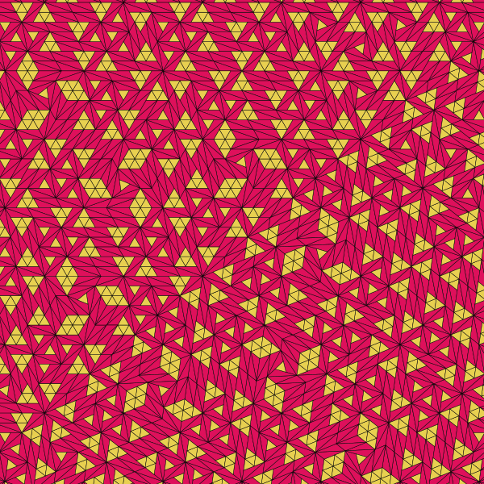
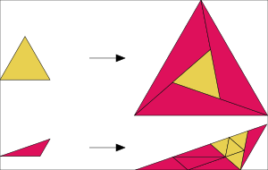

## 4-fold [[1]](#1)

## 5-fold alt [[2]](#2)

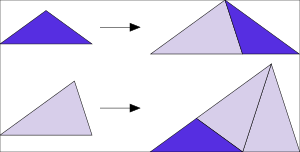

## 6-fold alt [[2]](#2)

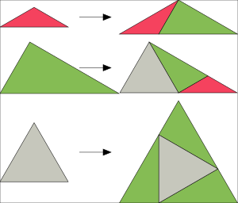

## 6-fold alt2 [[2]](#2)

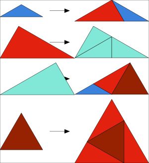

## 6-fold alt3 [[2]](#2)

## 5-fold [[1]](#1)

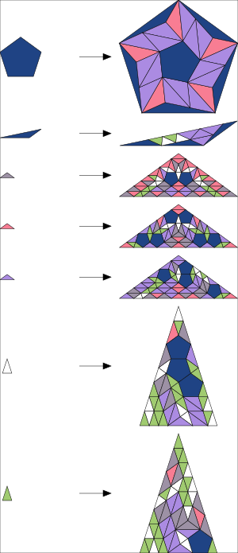

## 6-fold [[1]](#1)

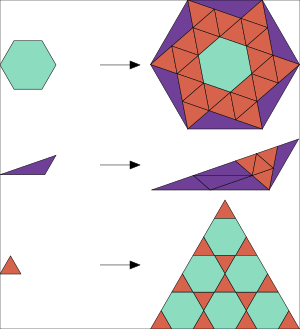

## 7-fold [[2]](#2)

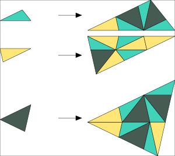

## 8-fold [[1]](#1)

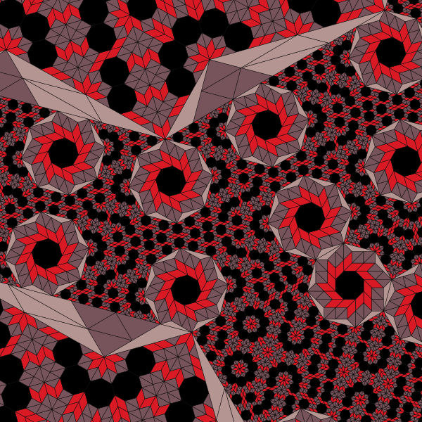

## Penrose [[3]](#3)

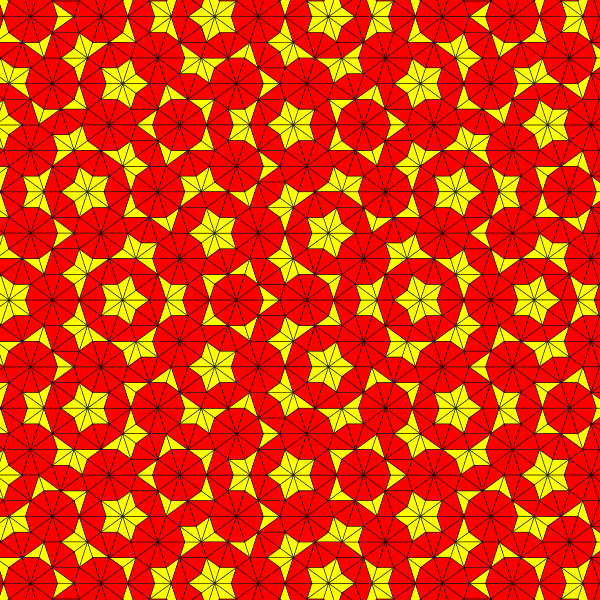
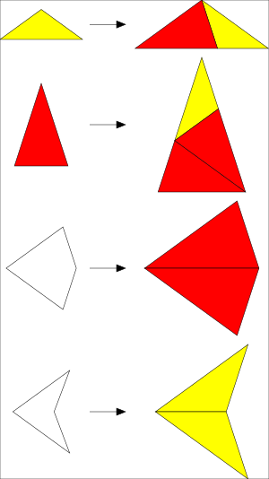

## References

<a id="1">[1]</a>
Frettlöh, D and Say-awen, A. L. D. and de las Peñas, M. L. A. N.
Substitution tilings with dense tile orientations and n-fold rotational symmetry.
Indagationes Mathematicae, 28(1), pp. 120-131 (2017), [arxiv 1602.00518](https://arxiv.org/pdf/1602.00518.pdf).

<a id="2">[2]</a>
Nischke, KP., Danzer, L.
A construction of inflation rules based onn-fold symmetry.
Discrete Comput Geom 15, 221–236 (1996), [doi BF02717732](https://doi.org/10.1007/BF02717732).

<a id="3">[3]</a>
[Wikipedia: Penrose tiling](https://en.wikipedia.org/wiki/Penrose_tiling#Deflation_for_P2_and_P3_tilings)
