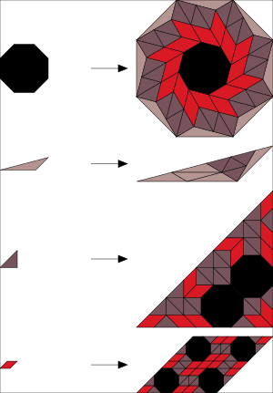

# subtiler

## 3-fold [[1]](#1)

## 4-fold [[1]](#1)

## 5-fold [[2]](#2)

## 5-fold alt [[1]](#1)

## 6-fold [[1]](#1)

## 8-fold [[1]](#1)

## References

<a id="1">[1]</a>
Frettlöh, D and Say-awen, A. L. D. and de las Peñas, M. L. A. N.
Substitution tilings with dense tile orientations and n-fold rotational symmetry.
Indagationes Mathematicae, 28(1), pp. 120-131 (2017), [arxiv 1602.00518](https://arxiv.org/pdf/1602.00518.pdf).

<a id="2">[2]</a>
Nischke, KP., Danzer, L.
A construction of inflation rules based onn-fold symmetry.
Discrete Comput Geom 15, 221–236 (1996), [doi BF02717732](https://doi.org/10.1007/BF02717732).
